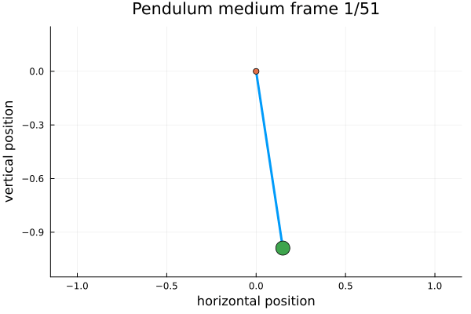

# Nonlinear Pendulum Lusch2018 Medium Dataset Report

## Task Summary

Generated the Lusch-aligned undamped nonlinear pendulum dataset with full-state clean observations. The system is x1_dot = x2 and x2_dot = -sin(x1), with tau = 0.02, t in [0, 1], and 51 snapshots per trajectory.

## Configuration

- System ID: `nonlinear_pendulum_lusch2018`
- Scope: `v1_plus`
- Variant: `medium_lusch_aligned_full_state`
- Number of trajectories: 512
- Snapshot count: 51
- Transition count: 50
- Acceptance rate: 0.6282208588957056

## Validation Results

- State matrix size: `[2, 51]`
- Full-state observation error max: 0.0
- Initial energy range: [-0.9853630298668495, 0.9891474510385618]
- Energy drift max: 3.113918012331851e-9
- Energy drift p95: 2.1828001628421134e-9
- Separatrix violation count: 0
- Energy band counts: low=117, mid=259, high=136
- Near-separatrix initial count: 31
- Medium validation passed: true

## Split And Window Counts

- Split counts: `Dict("test" => 77, "val" => 77, "train" => 358)`
- One-step counts: `Dict("test" => 3850, "val" => 3850, "train" => 17900)`
- Rollout counts: `Dict("h10" => Dict("test" => 3157, "val" => 3157, "train" => 14678), "h25" => Dict("test" => 2002, "val" => 2002, "train" => 9308))`
- Statistics counts: `Dict("test" => 77, "val" => 77, "train" => 358)`

## Animation

## Generated Files

- `animation_path`: `D:\MyVault\Projects\Julia\ODEs_dataset\reports\v1_plus\nonlinear_pendulum_lusch2018_medium\plots\pendulum_physical_animation_medium.gif`
- `energy_summary_path`: `D:\MyVault\Projects\Julia\ODEs_dataset\reports\v1_plus\nonlinear_pendulum_lusch2018_medium\tables\energy_summary.csv`
- `log_path`: `D:\MyVault\Projects\Julia\ODEs_dataset\reports\v1_plus\nonlinear_pendulum_lusch2018_medium\logs\medium.log`
- `manifest_path`: `D:\MyVault\Projects\Julia\ODEs_dataset\data\manifests\v1_plus\nonlinear_pendulum_lusch2018\medium\manifest.json`
- `processed_path`: `D:\MyVault\Projects\Julia\ODEs_dataset\data\processed\v1_plus\nonlinear_pendulum_lusch2018\medium\full_state_clean\observed_trajectories.jld2`
- `raw_path`: `D:\MyVault\Projects\Julia\ODEs_dataset\data\raw\v1_plus\nonlinear_pendulum_lusch2018\medium\raw_trajectories.jld2`
- `release_index_path`: `D:\MyVault\Projects\Julia\ODEs_dataset\data\releases\v1_plus\nonlinear_pendulum_lusch2018\medium\release_index.json`
- `split_path`: `D:\MyVault\Projects\Julia\ODEs_dataset\data\processed\v1_plus\nonlinear_pendulum_lusch2018\medium\full_state_clean\splits.json`
- `split_window_counts_path`: `D:\MyVault\Projects\Julia\ODEs_dataset\reports\v1_plus\nonlinear_pendulum_lusch2018_medium\tables\split_window_counts.csv`
- `table_path`: `D:\MyVault\Projects\Julia\ODEs_dataset\reports\v1_plus\nonlinear_pendulum_lusch2018_medium\tables\diagnostics.csv`
- `windows_summary_path`: `D:\MyVault\Projects\Julia\ODEs_dataset\data\processed\v1_plus\nonlinear_pendulum_lusch2018\medium\full_state_clean\windows_summary.json`
